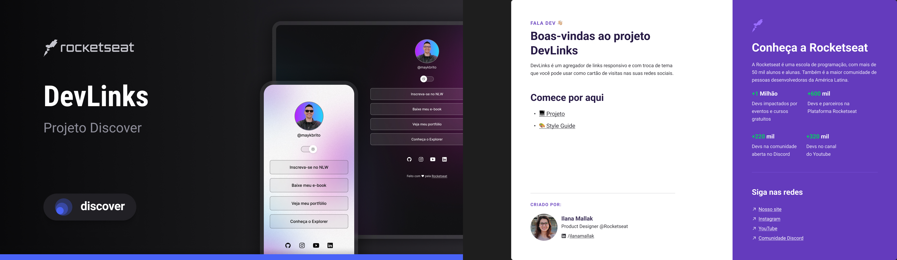

<h1 align="center"> Bolsonaro2026</h1>

Programa Bolsonaro 2026, é o ZeroUm

  <a href="#-tecnologias">Tecnologias</a>&nbsp;&nbsp;&nbsp;|&nbsp;&nbsp;&nbsp;
  <a href="#-projeto">Projeto</a>&nbsp;&nbsp;&nbsp;|&nbsp;&nbsp;&nbsp;
  <a href="#-layout">Layout</a>&nbsp;&nbsp;&nbsp;|&nbsp;&nbsp;&nbsp;
  <a href="#memo-licença">Licença</a>

  

 

  

## 🚀 Tecnologias

Esse projeto foi desenvolvido com as seguintes tecnologias:

- Brasil
- Amor
- Capital

## 💻 Projeto

Fora lula

## 🔖 Layout

Você pode visualizar o layout do projeto através [DESSE LINK](https://www.figma.com/design/YIMM4JyfJTqUsOtxRZfqrd/DevLinks-%E2%80%A2-Projeto-Discover--Community-?node-id=1439-690&t=e1b1H0eZiOdEqCrI-0). É necessário ter conta no [Figma](https://figma.com) para acessá-lo.

## :memo: Licença

Esse projeto está sob a licença MIT.

---

Feito com ♥ by Bolsonier :wave: [Participe da nossa comunidade!](https://discord.gg/rocketseat)
